

  

---

## Wordpress Expert | Elementor Expert | Woocommerce Expert | Shopify Expert

Hi, I'm **Arif Hossin**, a full-time web developer with 7 years of experience in front-end development, WordPress WooCommerce theme development, and Shopify theme development. I specialize in developing and cloning all types of websites using WordPress and Shopify, ensuring high-quality service for my clients. I'm available 24/7 to assist with any web-based issues you may have. Feel free to contact me anytime!

# 🚀 **RECENT PROJECTS**

List of projects I made with love

| Html/Bootstrap | Html/Tailwind | NextJs | WordPress | Shopify |
| --- | --- | --- | --- | --- |
| <a target="_blank" href="https://moteur.netlify.app/"><b>Moteur and Sens</b></a> | <a target="_blank" href="https://tipsy-turtles.netlify.app/"><b>Tipsy Turtles</b></a> | <a target="_blank" href="https://tipsy-turtles.netlify.app/"><b>Tipsy Turtles</b></a> | <a target="_blank" href="https://bohair.be/"><b>Bohair</b></a> | <a target="_blank" href="https://hsmotorsports.net/"><b>HS Motor Sports</b></a> |
| <a target="_blank" href="https://4es-consulting.netlify.app/"><b>4es Consulting</b></a> | <a target="_blank" href="https://webdevarif-babogue.netlify.app/"><b>Babogue</b></a> | <a target="_blank" href="https://webdevarif-babogue.netlify.app/"><b>Babogue</b></a> | <a target="_blank" href="https://houseofco.eu/"><b>Houseofco</b></a> | <a target="_blank" href="https://tyresse.com/"><b>Tyresse</b></a> |
| <a target="_blank" href="https://vincechain.netlify.app/"><b>Vincechain</b></a> | <a target="_blank" href="https://webdevarif-taksvarden.netlify.app/"><b>Taksvarden</b></a> | <a target="_blank" href="https://webdevarif-taksvarden.netlify.app/"><b>Taksvarden</b></a> | <a target="_blank" href="https://arroyotires.com/"><b>Arroyotires</b></a> | <a target="_blank" href="https://www.bigfrenchies.com/"><b>Big Frenchies</b></a> |
| <a target="_blank" href="https://stack-internal.netlify.app/"><b>Stack Internal</b></a> | TAILWIND PROJECT | <a target="_blank" href="https://eirik-therapie.vercel.app/"><b>Eirik Therapie</b></a> | <a target="_blank" href="https://digitalfarmers.be/"><b>Digital Farmers</b></a> | <a target="_blank" href="https://lockoffroadwheels.com/"><b>Lockoffroadwheels</b></a> |
| <a target="_blank" href="https://tech-future.netlify.app/"><b>Tech Future (Ecommerce)</b></a> | TAILWIND PROJECT | NEXTJS PROJECT | <a target="_blank" href="https://hatchpro.net/"><b>Hatch Pro</b></a> | <a target="_blank" href="https://katanawheels.myshopify.com/"><b>Katana Wheels</b></a> |
| <a target="_blank" href="https://foto-box.netlify.app/"><b>Fotobox</b></a> | TAILWIND PROJECT | NEXTJS PROJECT | <a target="_blank" href="https://casayaspa.be/"><b>Casayaspa</b></a> | <a target="_blank" href="https://dolcewheels.myshopify.com/"><b>Dolce Wheels</b></a> |
| <a target="_blank" href="https://assparo.netlify.app/"><b>Assparo</b></a> | TAILWIND PROJECT | NEXTJS PROJECT | <a target="_blank" href="https://riohondoofficeandmedicalplaza.com/"><b>Rio Hondo</b></a> | <a target="_blank" href="https://www.valentinewigs.co.uk/"><b>Valentine Wigs</b></a> |

## Tools I use

  
  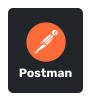
  
  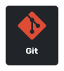
  

## Photoshop I use

  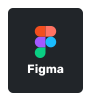
  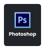
  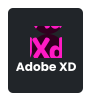

## Frontend Development

  
  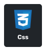
  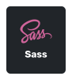
  
  
  
  
  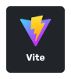

## Frameworks and Packages

  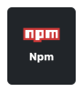
  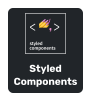
  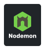
  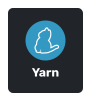
  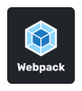
  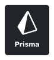
  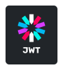
  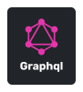
  

## Database

  
  
  
  

## Backend Development

  
  
  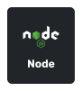

##

 

 
 	
  
 
 
 
  
  
  

 

  
  
  

<!-- Proudly created with GPRM ( https://gprm.itsvg.in ) -->