

  

<h1 align="center">Hi, I'm Arif Hossin 👋</h1>
<h3 align="center">Shopify App &amp; Theme Developer · Shopify Plus · Headless Commerce</h3>

  
  
  
  
  

---

## 👨‍💻 About Me

I'm a **Shopify App & Theme Developer** with **8+ years** of experience building fast, conversion-focused ecommerce experiences. I'm currently a **Shopify Expert at Hatch Pro (US)**, and I've previously worked with **Ecom Experts** (Shopify Plus agency, Canada) and **Digital Farmers** (WooCommerce agency, Belgium).

Over the years I've **shipped 500+ projects** across freelance platforms and agencies, and I build and maintain my own **Shopify apps and SaaS products** on the side. With a background in Marketing, I care as much about **revenue, UX, and store performance** as I do about clean, maintainable code.

- 🛍️ Custom **Liquid** themes & **Shopify Plus** storefronts
- 🧩 Shopify **app development** with Polaris & App Bridge
- ⚡ **Headless commerce** with Hydrogen / Oxygen & Next.js
- 🎯 **Conversion rate** & Core Web Vitals / performance optimization
- 🌐 **WordPress / WooCommerce** solutions
- 📈 Top Rated on Upwork · Level 2 on Fiverr · open for select projects

> 💬 I offer a free 30-minute consultation — reach out anytime via [webdevarif.com](https://webdevarif.com).

# 🚀 **RECENT PROJECTS**

A selection of websites and stores I've built with care

| Html/Bootstrap | Html/Tailwind | NextJs | WordPress | Shopify |
| --- | --- | --- | --- | --- |
| <a target="_blank" href="https://moteur.netlify.app/"><b>Moteur and Sens</b></a> | <a target="_blank" href="https://tipsy-turtles.netlify.app/"><b>Tipsy Turtles</b></a> | <a target="_blank" href="https://tipsy-turtles.netlify.app/"><b>Tipsy Turtles</b></a> | <a target="_blank" href="https://bohair.be/"><b>Bohair</b></a> | <a target="_blank" href="https://hsmotorsports.net/"><b>HS Motor Sports</b></a> |
| <a target="_blank" href="https://4es-consulting.netlify.app/"><b>4es Consulting</b></a> | <a target="_blank" href="https://webdevarif-babogue.netlify.app/"><b>Babogue</b></a> | <a target="_blank" href="https://webdevarif-babogue.netlify.app/"><b>Babogue</b></a> | <a target="_blank" href="https://houseofco.eu/"><b>Houseofco</b></a> | <a target="_blank" href="https://tyresse.com/"><b>Tyresse</b></a> |
| <a target="_blank" href="https://vincechain.netlify.app/"><b>Vincechain</b></a> | <a target="_blank" href="https://webdevarif-taksvarden.netlify.app/"><b>Taksvarden</b></a> | <a target="_blank" href="https://webdevarif-taksvarden.netlify.app/"><b>Taksvarden</b></a> | <a target="_blank" href="https://arroyotires.com/"><b>Arroyotires</b></a> | <a target="_blank" href="https://www.bigfrenchies.com/"><b>Big Frenchies</b></a> |
| <a target="_blank" href="https://stack-internal.netlify.app/"><b>Stack Internal</b></a> | TAILWIND PROJECT | <a target="_blank" href="https://eirik-therapie.vercel.app/"><b>Eirik Therapie</b></a> | <a target="_blank" href="https://digitalfarmers.be/"><b>Digital Farmers</b></a> | <a target="_blank" href="https://lockoffroadwheels.com/"><b>Lockoffroadwheels</b></a> |
| <a target="_blank" href="https://tech-future.netlify.app/"><b>Tech Future (Ecommerce)</b></a> | TAILWIND PROJECT | NEXTJS PROJECT | <a target="_blank" href="https://hatchpro.net/"><b>Hatch Pro</b></a> | <a target="_blank" href="https://katanawheels.myshopify.com/"><b>Katana Wheels</b></a> |
| <a target="_blank" href="https://foto-box.netlify.app/"><b>Fotobox</b></a> | TAILWIND PROJECT | NEXTJS PROJECT | <a target="_blank" href="https://casayaspa.be/"><b>Casayaspa</b></a> | <a target="_blank" href="https://dolcewheels.myshopify.com/"><b>Dolce Wheels</b></a> |
| <a target="_blank" href="https://assparo.netlify.app/"><b>Assparo</b></a> | TAILWIND PROJECT | NEXTJS PROJECT | <a target="_blank" href="https://riohondoofficeandmedicalplaza.com/"><b>Rio Hondo</b></a> | <a target="_blank" href="https://www.valentinewigs.co.uk/"><b>Valentine Wigs</b></a> |
| HTML/Bootstrap | TAILWIND PROJECT | NEXTJS PROJECT | WORDPRESS PROJECT | <a target="_blank" href="https://robinphotography.myshopify.com/"><b>Robin Photography</b></a> |

## 📦 Published Products

| App | Tag | Description |
|-----|-----|-------------|
| [TablePilot](https://apps.shopify.com/table-pilot) | Shopify App | Pricing tables, spec tables, and comparison tables for Shopify stores. Built with Liquid and Shopify App Bridge. |
| [GoFitment](https://apps.shopify.com/gofitment) | Shopify App | Year/Make/Model fitment search app. Helps customers find compatible products for their vehicle. |
| Surfacly | SaaS | My own SaaS — live with first client. A surface-level analytics and conversion tool for ecommerce. |

---

## 🧰 Tech Stack

**Ecommerce & CMS**

  
  
  
  
  
  

**Frontend Development**

  
  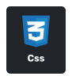
  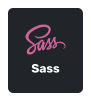
  
  
  
  
  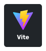

**Frameworks &amp; Packages**

  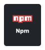
  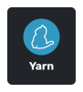
  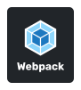
  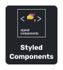
  
  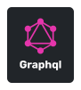
  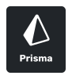
  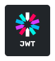
  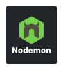

**Backend Development**

  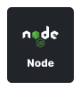
  
  

**Databases**

  
  
  
  

**Tools &amp; Design**

  
  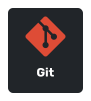
  
  
  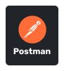
  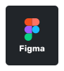
  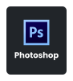
  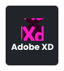

---

## 📫 Connect With Me

  
  
  
  
  
  
  
  
  

 

## 📊 GitHub Stats

  
  

  

