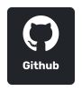
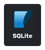

  

---

## 👋 Hi there!

My name is **Arif Hossin** and I do open source for fun.
The projects you will find on this profile are just random things I've built at one point or another to make my life easier.
Hopefully they can be useful to you as well.

- To see the list of my most popular projects, [visit my website](https://webdeveloperarif.com/projects/).
- If you want to contact me, join my [Discord server](https://discordapp.com/users/3762) or tag me on [Twitter](https://twitter.com/webdevarif).

# 🚀 **Recent Projects**

List of projects I made with love

| Name | Category | Description | Links |
| --- | :---: | --- | --- |
| <a href="https://webdeveloperarif.com/"><b>Portfolio</b></a> |  | 🧙‍♂️ My personal website | <table><tr><td>   </td></tr></table> |
| <a href="https://moteur.netlify.app/"><b>Moteur and Sens</b></a> |  | 🦒 Html5, Bootstrap@5.2, Sass, Gulp, Vanilla Javascript | <table><tr><td>   </td></tr></table> |
| <a href="https://bohair.be/"><b>Bohair</b></a> |  | 🦒 WordPress, Woocommerce, Elementor Pro, DigitalFarmers Plugins | <table><tr><td>   </td></tr></table> |
| <a href="https://github.com/ptkdev/all-shields-cli"><b>All Shields CLI</b></a> |  | 🦌 Tool to help automate your badges from dotfiles for your markdown.  | <table><tr><td>  </td><td>  </td></tr></table> |
| <a href="https://github.com/ptkdev/chrome-extension-aspectratio219"><b>Aspect Ratio 21:9</b></a> |  | 🖥️ Fit the screen properly in fullscreen mode on monitor ultrawide with 21:9 aspect ratio | <table><tr><td>  </td><td>  </td><td>  </td></tr></table> |
| <a href="https://availableon.badge.ptkdev.io/"><b>Badges: Available on</b></a> |  | 🛡 Badges Generator of Available on Store for websites and mobile app | <table><tr><td>   </td></tr></table> |
| <a href="https://github.com/ptkdev/json-token-replace"><b>JSON Token Replace</b></a> |  | 🾠Replace liquid variables {{name}} in json with values from another json where key is token | <table><tr><td>  </td><td>  </td></tr></table> |
| <a href="https://github.com/ptkdev/eslint-plugin-snakecasejs"><b>ESLint: snakecasejs</b></a> |  | ğŸ ESLint Plugin: enforce snake_case syntax on variables and function names | <table><tr><td>  </td><td>  </td></tr></table> |
| <a href="https://github.com/ptkdev-components/webcomponent-instagram-widget"><b>Instagram Widget</b></a> |  | 📸 Show latest 9 photos from your instagram account for your blog or website | <table><tr><td>  </td><td>  </td><td>   </td></tr></table> |
| <a href="https://github.com/ptkdev-components/webcomponent-patreon-box"><b>My Patreon Box</b></a> |  | 👑 My Patreon Tier Box with avatars and link from rest/json api. | <table><tr><td>  </td><td>  </td><td>   </td></tr></table> |
| <a href="https://github.com/ptkdev-components/webcomponent-carousel-slideshow"><b>Carousel Slideshow</b></a> |  | ğŸ Image Carousel: Simple slideshow for your blog or website  | <table><tr><td>  </td><td>  </td><td>   </td></tr></table> |
| <a href="https://github.com/ptkdev-boilerplate?q=svelte"><b>Svelte Boilerplate</b></a> |  | 📦 My personal Svelte Boilerplate to start create webapp, eleactron app and mobile app  | <table><tr><td>  </td></tr></table> |
| <a href="https://github.com/ptkdev-boilerplate?q=webcomponents"><b>WebComponents Boilerplate</b></a> |  | 🗠My personal boilerplate to start building a webcomponents | <table><tr><td>  </td></tr></table> |
| <a href="https://github.com/ptkdev-boilerplate?q=node"><b>Node Boilerplate</b></a> |  | 🤖 My personal Boilerplate to start building a nodejs app/cli with typescript | <table><tr><td>  </td></tr></table> |
| <a href="https://github.com/ptkdev-boilerplate?q=bot"><b>BOT Boilerplate</b></a> |  | 🤖 My personal Boilerplate to start building a bot with nodejs and typescript | <table><tr><td>  </td></tr></table> |
| <a href="https://github.com/ptkdev/vscode-theme-dark-blood"><b>Dark Blood Theme</b></a> |  | 🨠VSCode Theme: Dark Blood | <table><tr><td>  </td><td>  </td></tr></table> |
| <a href="https://t.me/quizquickanswerbot"><b>Quiz Quick Answer</b></a> |  | 🮠Quiz bot for telegram groups, play with friends! | <table><tr><td>  </td><td>  </td></tr><tr><td>   </td></tr></table> |
| <a href="https://t.me/gamebookchatbot"><b>GameBook Chat</b></a> |  | 📚 Italian telegram bot for play to game books on telegram | <table><tr><td>   </td></tr></table> |
| <a href="https://meingifs.pics/"><b>Me in Gifs</b></a> |  | 💅 Me in Gifs is an app to download wallpapers (templates) to beautify your Instagram Stories!  | <table><tr><td>  </td><td>  </td><td>   </td></tr></table> |
| <a href="https://github.com/ptkdev/ptkdev-stickers"><b>Stickers</b></a> |  | 📱 PTKDev Stickers for Telegram, Whatsapp, iMessage and Discord  | <table><tr><td>   </td><td>   </td><td>  </td></tr></table> |

## Tools I use

  
  
  
  
  

## Photoshop I use

  
  
  

## Frontend Development

  
  
  
  
  
  
  
  

## Frameworks and Packages

  
  
  
  
  
  
  
  
  

## Database

  
  
  
  

## Backend Development

  
  
  

##

 

 
 	
  
 
 
 
  
  
  

 

  
  

##

<!-- Proudly created with GPRM ( https://gprm.itsvg.in ) -->